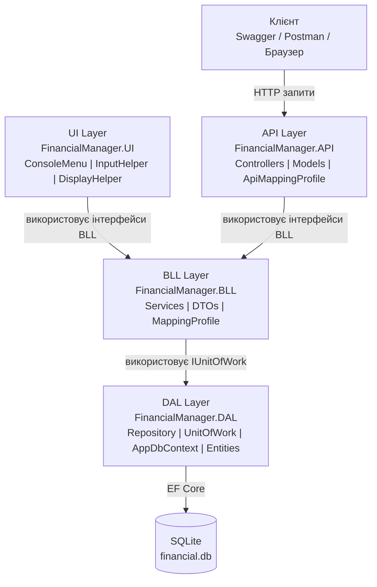
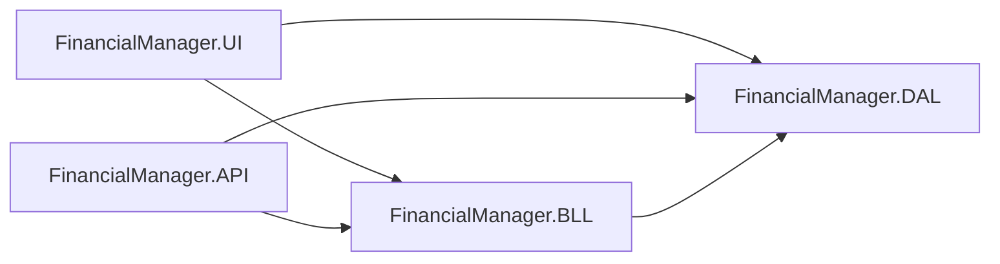
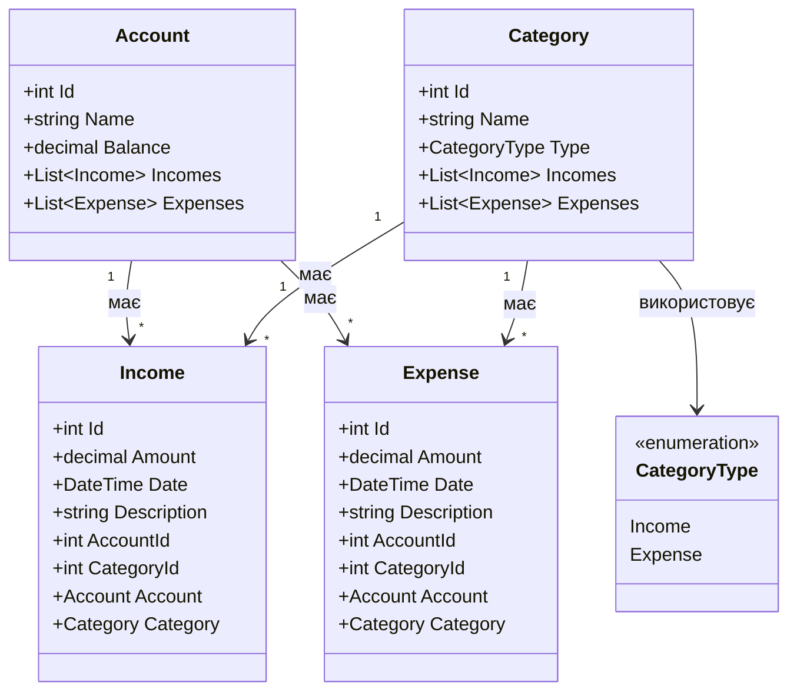
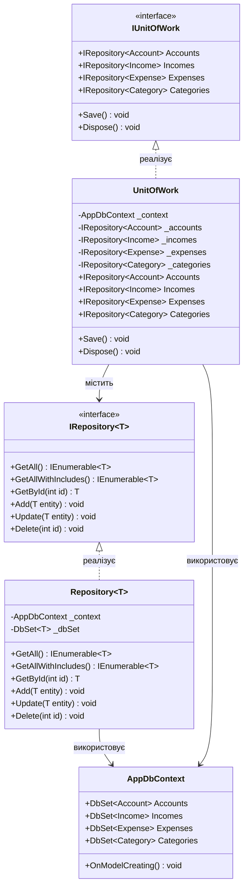
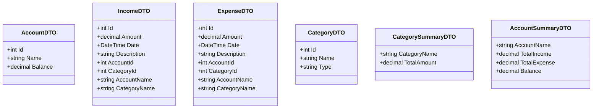
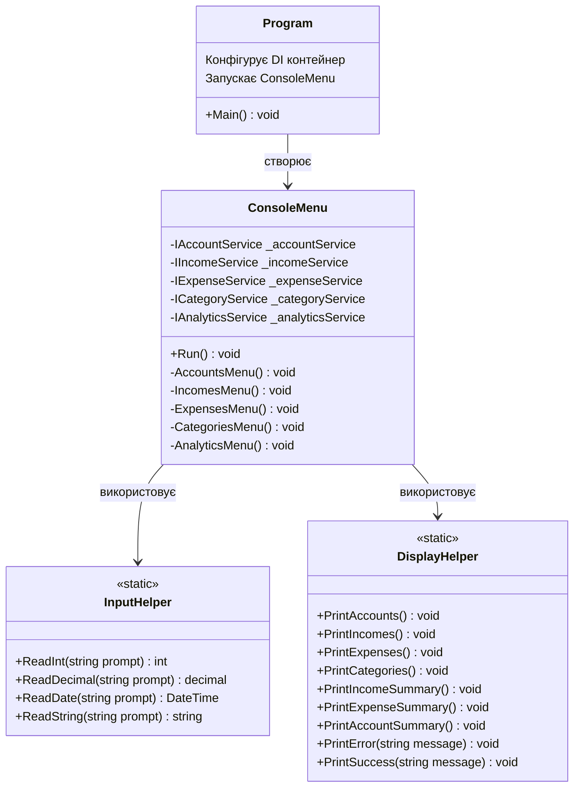
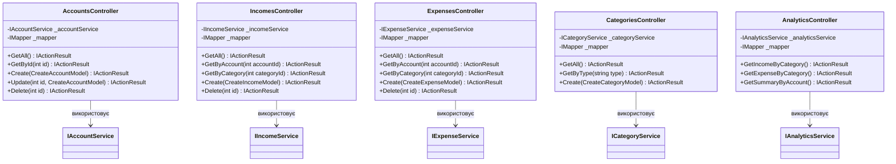
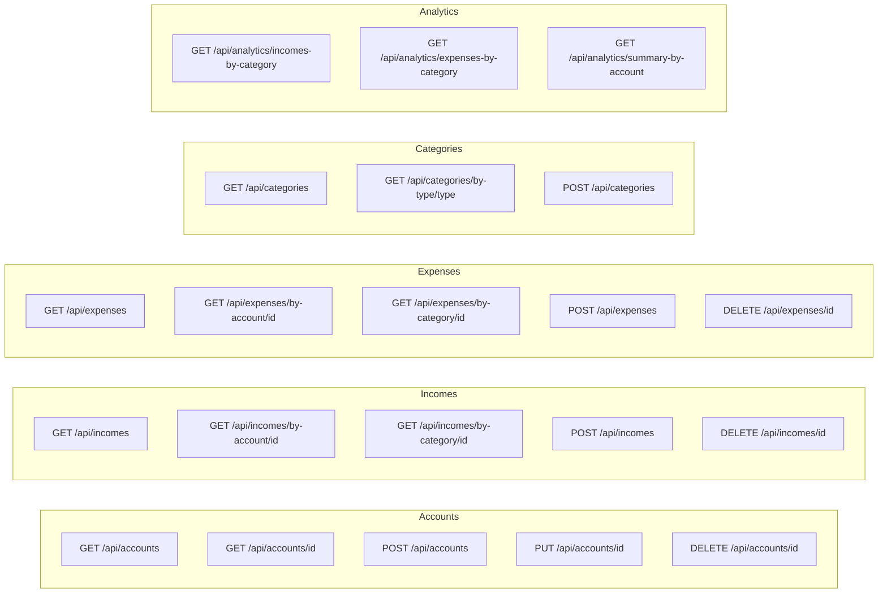

# UML Діаграми — Фінансовий Менеджер

---

## 1. Загальна архітектура

 
---

## 2. Залежності між проектами

 
---

## 3. Діаграма класів — DAL Entities

---

## 4. Діаграма класів — DAL Repository та UnitOfWork

---

## 5. Діаграма класів — BLL Інтерфейси та Сервіси

```mermaid
classDiagram
    class IAccountService {
        <<interface>>
        +GetAll() IEnumerable~AccountDTO~
        +GetById(int id) AccountDTO
        +Create(AccountDTO dto) void
        +Update(AccountDTO dto) void
        +Delete(int id) void
    }

    class IIncomeService {
        <<interface>>
        +GetAll() IEnumerable~IncomeDTO~
        +GetByAccount(int id) IEnumerable~IncomeDTO~
        +GetByCategory(int id) IEnumerable~IncomeDTO~
        +Create(IncomeDTO dto) void
        +Delete(int id) void
    }

    class IExpenseService {
        <<interface>>
        +GetAll() IEnumerable~ExpenseDTO~
        +GetByAccount(int id) IEnumerable~ExpenseDTO~
        +GetByCategory(int id) IEnumerable~ExpenseDTO~
        +Create(ExpenseDTO dto) void
        +Delete(int id) void
    }

    class ICategoryService {
        <<interface>>
        +GetAll() IEnumerable~CategoryDTO~
        +GetByType(string type) IEnumerable~CategoryDTO~
        +Create(CategoryDTO dto) void
    }

    class IAnalyticsService {
        <<interface>>
        +GetIncomeByCategory() IEnumerable~CategorySummaryDTO~
        +GetExpenseByCategory() IEnumerable~CategorySummaryDTO~
        +GetSummaryByAccount() IEnumerable~AccountSummaryDTO~
    }

    class AccountService {
        -IUnitOfWork _uow
        -IMapper _mapper
        +GetAll() IEnumerable~AccountDTO~
        +GetById(int id) AccountDTO
        +Create(AccountDTO dto) void
        +Update(AccountDTO dto) void
        +Delete(int id) void
    }

    class IncomeService {
        -IUnitOfWork _uow
        -IMapper _mapper
        +GetAll() IEnumerable~IncomeDTO~
        +GetByAccount(int id) IEnumerable~IncomeDTO~
        +GetByCategory(int id) IEnumerable~IncomeDTO~
        +Create(IncomeDTO dto) void
        +Delete(int id) void
    }

    class ExpenseService {
        -IUnitOfWork _uow
        -IMapper _mapper
        +GetAll() IEnumerable~ExpenseDTO~
        +GetByAccount(int id) IEnumerable~ExpenseDTO~
        +GetByCategory(int id) IEnumerable~ExpenseDTO~
        +Create(ExpenseDTO dto) void
        +Delete(int id) void
    }

    class CategoryService {
        -IUnitOfWork _uow
        -IMapper _mapper
        +GetAll() IEnumerable~CategoryDTO~
        +GetByType(string type) IEnumerable~CategoryDTO~
        +Create(CategoryDTO dto) void
    }

    class AnalyticsService {
        -IUnitOfWork _uow
        +GetIncomeByCategory() IEnumerable~CategorySummaryDTO~
        +GetExpenseByCategory() IEnumerable~CategorySummaryDTO~
        +GetSummaryByAccount() IEnumerable~AccountSummaryDTO~
    }

    IAccountService <|.. AccountService : реалізує
    IIncomeService <|.. IncomeService : реалізує
    IExpenseService <|.. ExpenseService : реалізує
    ICategoryService <|.. CategoryService : реалізує
    IAnalyticsService <|.. AnalyticsService : реалізує
```

---

## 6. Діаграма класів — BLL DTOs

---

## 7. Діаграма класів — UI

---

## 8. Діаграма класів — API Models

```mermaid
classDiagram
    class AccountModel {
        +int Id
        +string Name
        +decimal Balance
    }
 
    class CreateAccountModel {
        +string Name
        +decimal Balance
    }
 
    class IncomeModel {
        +int Id
        +decimal Amount
        +DateTime Date
        +string Description
        +string AccountName
        +string CategoryName
        +int AccountId
        +int CategoryId
    }
 
    class CreateIncomeModel {
        +decimal Amount
        +DateTime Date
        +string Description
        +int AccountId
        +int CategoryId
    }
 
    class ExpenseModel {
        +int Id
        +decimal Amount
        +DateTime Date
        +string Description
        +string AccountName
        +string CategoryName
        +int AccountId
        +int CategoryId
    }
 
    class CreateExpenseModel {
        +decimal Amount
        +DateTime Date
        +string Description
        +int AccountId
        +int CategoryId
    }
 
    class CategoryModel {
        +int Id
        +string Name
        +string Type
    }
 
    class CreateCategoryModel {
        +string Name
        +string Type
    }
 
    class CategorySummaryModel {
        +string CategoryName
        +decimal TotalAmount
    }
 
    class AccountSummaryModel {
        +string AccountName
        +decimal TotalIncome
        +decimal TotalExpense
        +decimal Balance
    }
```
 

 
---
 
## 9. Діаграма класів — API Controllers
 

 
---

## 10. HTTP методи та endpoints
 

